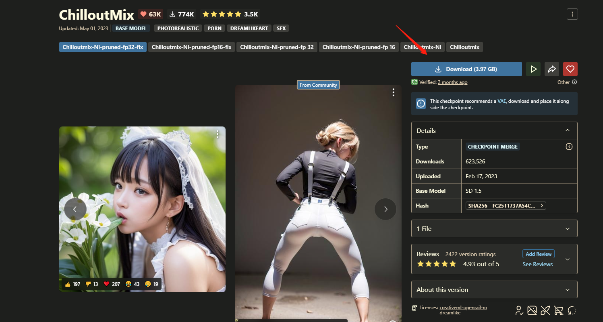
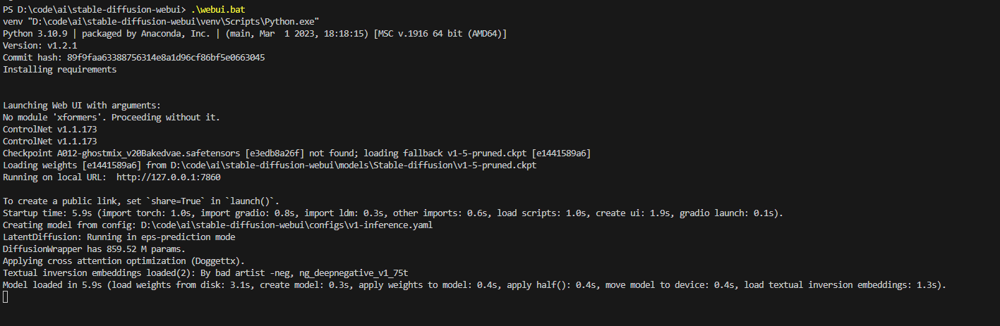
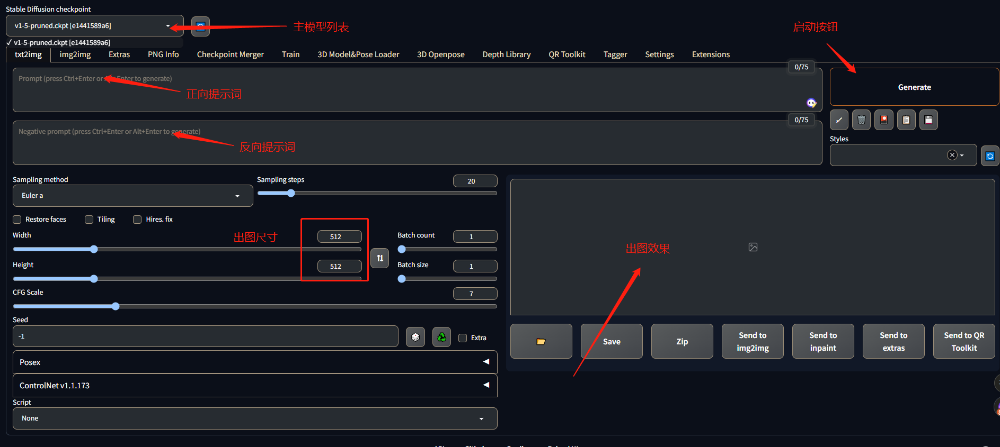

[封面图]

[Github地址](https://github.com/CompVis/stable-diffusion)

[网站](https://stablediffusionweb.com/)

## 简介

Stable Diffusion

一句话描述：Stable Diffusion是2022年发布的[深度学习文本到图像生成模型](https://zh.wikipedia.org/wiki/%E6%B7%B1%E5%BA%A6%E5%AD%A6%E4%B9%A0)，它主要用于根据文本的描述产生详细图像。

也有热心网友开发了WEB页面易于使用，叫做[stable-diffusion-webui](https://github.com/AUTOMATIC1111/stable-diffusion-webui)

## 安装

### 配置要求

* 最低配置4GB显存，基本配置6GB显存，推荐配置12GB显存。
* 内存也不能太小，最好大于16GB

笔者的显卡是`NVIDIA GeForce GTX 3080 (10GB/NVIDIA)`

### 安装Python 3.10.6

[Windows系统安装包](https://www.python.org/ftp/python/3.10.6/python-3.10.6-amd64.exe)

【tips】

1. 安装的时候记得将`环境变量`勾上。
2. 安装完成后，使用快捷键`Win+R`，输入`cmd`后回车，在命令行窗口输入`python`再次回车能正确显示版本即可。

### 下载stable-diffusion-webui

[Github仓库地址](https://github.com/AUTOMATIC1111/stable-diffusion-webui)

可以下载压缩包，也可以使用`git clone`方式下载。（推荐使用`git clone`方式）

【tips】

使用`git clone`方式需要安装`git`,安装完成后，使用快捷键`Win+R`，输入`cmd`后回车，在命令行窗口输入`git --version`再次回车能正确显示版本即可

下载地址：https://git-scm.com/download/win

### 下载权重文件

[下载地址](https://huggingface.co/runwayml/stable-diffusion-v1-5/resolve/main/v1-5-pruned.ckpt)

这是stable diffusion运行必须的权重文件,下载完成后放到models/Stable-diffusion目录下即可。

### 下载本文需要的模型文件，主要用于真人风格图像绘制

ChilloutMix

可以去C站下载，3.97G，下载完成后放到models/Stable-diffusion目录下

### 启动应用

双击根目录下的`webui.bat`脚本启动应用。

第一次启动需要下载相关依赖文件，大概会持续半个小时左右。

如果下载资源持续报错，可以尝试将将目录下的`launch.py`文件中的`https://github.com/`的下载地址前统一加上`https://ghproxy.com/`，最终的地址如`https://ghproxy.com/https://github.com/Stability-AI/stablediffusion.git`

以下为应用启动成功时打印的内容：

此时访问`http://127.0.0.1:7860`就能看到stable diffusion的页面，如下所示：

## 尝试生成漂亮AI美女

[原图](https://civitai.com/images/163560?modelVersionId=11745&prioritizedUserIds=-1&period=AllTime&sort=Most+Reactions&limit=20)

### 主模型下载

https://civitai.com/models/43331/majicmix-realistic

下载完成后放到models/Stable-diffusion目录下

### 

## 专业术语解释

* C站：即`https://civitai.com/`，是`AI`艺术生成社区唯一的模型共享中心，里面的图片都是AI绘制的
* CHECKPOINT：可以理解为是一种模型的格式，这种格式叫CHECKPOINT，这种文件一般比较大，动辄数GB。
* LORA：可以理解成基于模型的微调，使用了某种LORA那么风格就趋近于它，LORA文件比较小，一般是几百MB。
* 文生图