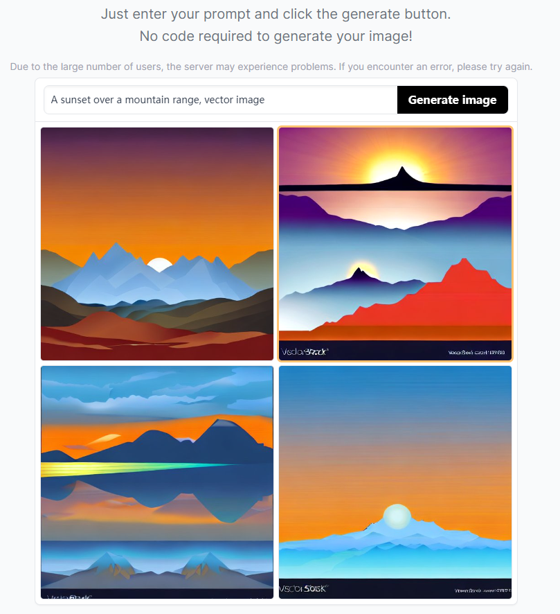
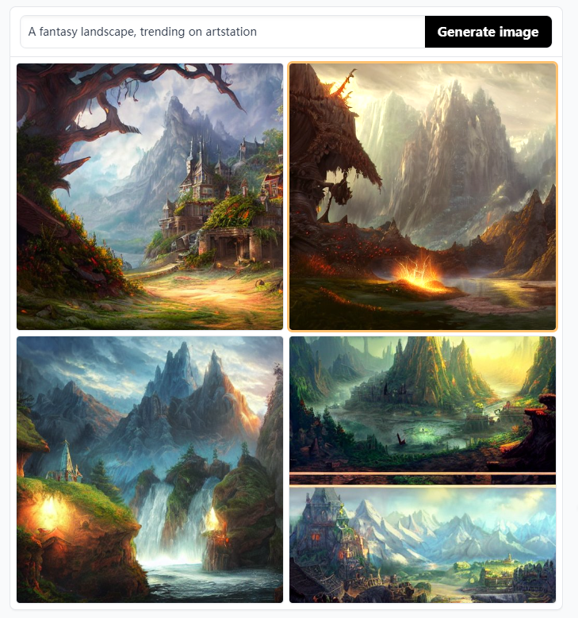
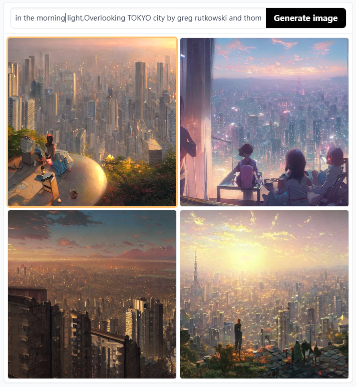

[封面图]

[Github地址](https://github.com/CompVis/stable-diffusion)

[网站](https://stablediffusionweb.com/)

## 概论

稳定扩散的文字生成图片是一种使用计算机程序，将一些文本转化为图像的技术。这种技术能够将任意文本生成出独特的、复杂的图案，并且这些图案看起来非常美观和有趣。

在这个过程中，计算机程序会根据输入的文本进行计算和处理，并且将其转换成一系列数字。然后，这些数字被用作控制像素点颜色和位置的参数。通过适当地调整这些参数，程序可以生成各种不同风格和形态的图案，从简单的几何形状到复杂的艺术品级别的图像都可以实现。

最终生成的图像通常具有高度抽象化的特征，而且每个图像都是独一无二的。因此，在许多应用中，稳定扩散的文字生成图片技术被广泛用于创造独特、富有表现力的视觉效果，并且被应用在电影特效、游戏设计、艺术创作等诸多领域。

目前AI绘画最火的当属Midjorney和Stable Diffusion，但是由于Midjourney没有开源，因此我们主要分享下Stable Diffusion。

[在线体验](https://stablediffusionweb.com/#demo)

【A sunset over a mountain range, vector image】

【A fantasy landscape, trending on artstation】

【in the morning light,Overlooking TOKYO city by greg rutkowski and thomas kinkade,Trending on artstationmakoto shinkai style】

【A beautiful painting of a singular lighthouse, shining its light across a tumultuous sea of blood by greg rutkowski and thomas kinkade, Trending on artstation.】

## Stable Diffusion名词解释

* Model: 模型可以看作是一种随机过程，其中不同点之间的差异逐渐变小或平滑。通过调整模型中的参数，可以控制生成图像的风格和特征。
* LoRA: LoRA是一个基于深度学习技术的稳定扩散文字生成图片模型，它采用了自动编码器的结构。LoRA将输入文本嵌入到一个低维空间中，并且使用稳定扩散模型来生成图片。这种方法能够同时保留语义信息和视觉特征。
* VAE: VAE是一种基于变分推断和深度学习技术的生成模型，其全称为Variational Autoencoder。VAE将输入文本映射到一个潜在空间中，并且利用稳定扩散模型来生成图像。这种方法能够在生成图像的同时，对输入数据进行压缩和重建，并且具有较好的泛化性能。
* ControlNet：ControlNet是一种通过添加额外条件来控制扩散模型的神经网络结构，它改变了人工智能图像生成的游戏规则。它为稳定扩散带来了前所未有的控制水平。ControlNet的革命性之处在于它解决了空间一致性问题。尽管以前根本没有有效的方法来告诉人工智能模型要保留输入图像的哪些部分，但ControlNet通过引入一种方法来改变这一点，使稳定扩散模型能够使用额外的输入条件来告诉模型该做什么

