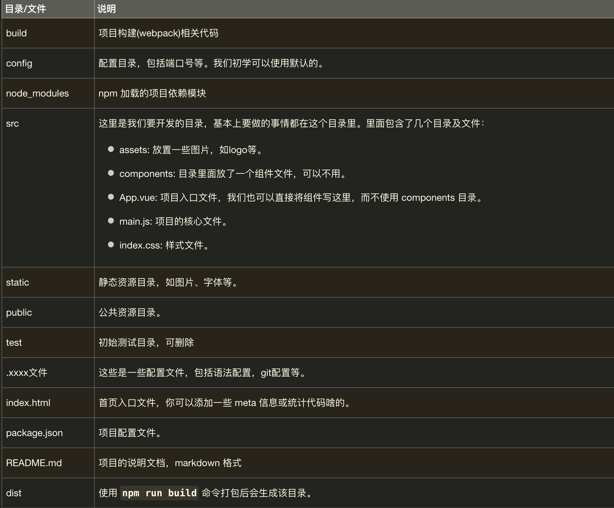

[vue3教程](https://www.runoob.com/vue3/vue3-tutorial.html)

预备知识：HTML、CSS、JavaScript

> vue.js（读音 /vjuː/, 类似于 view） 是一套构建用户界面的渐进式框架。
Vue 只关注视图层， 采用自底向上增量开发的设计。
Vue 的目标是通过尽可能简单的 API 实现响应的数据绑定和组合的视图组件。
Vue 学习起来非常简单，本教程基于 Vue 3.0.5 版本测试。

## 基础

基础案例，如 `basic/demo.html`

安装cnpm：npm install cnpm -g
安装vue-cli：cnpm install -g @vue/cli
npm install --ignore-scripts




## 组件

```vue
<!-- 模板代码 -->
<template>
  <div id="app">
    
    <!-- 定义路由视图，视图内容根据router/index.js文件中Router对象的routes规则 -->
    <router-view/>
  </div>
</template>
<!-- 模板代码 -->

<script>
export default {
  name: 'App'
}
</script>

<style>

</style>
```

```vue
<!-- HelloWorld.vue -->
<!-- 定义组件模板 -->
<template>
  <div class="hello">
    <h1>{{ msg }}</h1>
    <h2>Essential Links</h2>
  </div>
</template>

<script>
// 引入组件
import HelloWorld from '@/components/HelloWorld'
// 导出组件 name： HelloWorld
export default {
  name: 'HelloWorld',
//   定义内部数据
  data () {
    return {
      msg: 'Welcome to Your Vue.js App'
    }
  }
}
</script>
<!--   编写CSS样式 -->
<style scoped>

</style>
```

Q1：如何把App中<HelloWorld>组件把msg参数带进去

