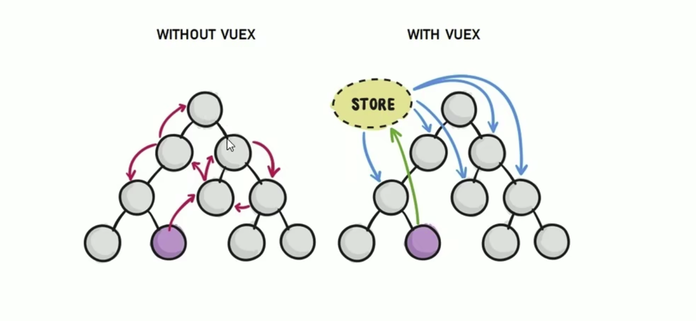

[封面图]


[在线学习](..//pic/vue/cover-vuex.jpeg)

## 概述

### 组件之间共享数据

1. 父向子传值：`v-bind 属性绑定`
2. 子向父传值：`v-on 事件绑定`
3. 兄弟组件之间共享数据：`EventBus`
   1. $on  接收数据的那个组件
   2. $emit 发送数据的那个组件

### Vuex
> Vuex是实现组件全局状态（数据）管理的一种机制，可以方便的实现组件之间数据的共享



### 使用Vuex统一管理状态的好处

1. 能够在Vuex中集中管理共享的数据，易于开发和后期维护
2. 能够高效地实现组件之间的数据共享，提高开发效率
3. 存储在Vuex中的数据都是响应式的，能够实现保持数据与页面的同步


### 什么样的数据是和存储到Vuex中

一般情况，只有组件之间共享的数据，才有必要存储到Vuex中，对于组件中的私有数据，依旧存储在组件自身的data中即可

## vuex基本使用

1. 安装vuex依赖包

```shell
npm install vuex --save
# 指定版本
sudo npm install vuex@3.6.2 --save
```

2. 导入vuex包

```js
import Vuex from 'vuex'
Vue.use(Vuex)
```

3. 创建store对象

```js
const store = new Vuex.Sotre({
    // state中存放的就是全局共享的数据
    state: {count: 0}
})
```

```js
// store.js
import Vue from 'vue'
import Vuex from 'vuex'

Vue.use(Vuex)

export default new Vuex.Store({
  state: {

  },
  mutations: {

  },
  actions: {

  }
})
```

4. 将store对象挂载到vue实例中

```js
new Vue({
    el: '#app',
    render: h => h(app),
    router,
    // 将创建的共享数据对象，挂载到Vue实例中
    // 所有的组件，就可以直接从store中获取全局的数据了
    store
})
```

## vuex核心概念

### 核心概念
* State
* Mutation
* Action
* Getter

### State
> State提供唯一的公共数据源，所有共享的数据都要统一放在Store的State中进行存储

```js
<!-- 创建store数据源，提供唯一公共数据 -->
const store = new Vuex.Store({
    state: {count: 0}
})
```

1. 组件访问State中数据的第一种方式

```js
<!-- template中访问this可以省略 -->
this.$store.state.全局数据名称
```

2. 组件访问State中数据的第二种方式

```js
// 1. 从Vuex中按需导入 mapState 函数
import {mapState} from 'vuex'
```

通过刚才导入的mapState函数，将当前组件需要的全局数据，映射为当前组件的computed计算属性

```js
computed: {
    ...mapState(['count'])
}
```

### Mutation
> Mutation用于变更Store中的数据

1. 只能通过Mutation变更Store数据，不可以直接操作Store中的数据
2. 通过这种方式虽然操作起来稍微繁琐一些，但是可以集中监控所有数据的变化

```js
<!-- 定义Mutation -->
const store = new Vuex.store({
    state: {
        count: 0
    },
    mutations: {
        add(state) {
            //变更状态
            state.count++
        }
    }
})
```

```js
<!-- 触发Mutation -->
methods: {
    handle1 () {
        <!-- 触发Mutation的第一种方式 -->
        this.$store.commit('add')
    }
}
```

`可以在触发Mutations时传递参数`

```js
<!-- 定义Mutation -->
const store = new Vuex.store({
    state: {
        count: 0
    },
    mutations: {
        add(state, step) {
            //变更状态
            state.count += step
        }
    }
})
```

```js
<!-- 触发Mutation -->
methods: {
    handle2 () {
        <!-- 触发Mutation时携带参数 -->
        this.$store.commit('add', 3)
    }
}
```

this.$store.comit()是触发Mutation的第一种方式，触发Mutation的第二种方式

```js
按需导入mapMutation函数
import {mapMutations} from 'vuex'
```

通过上面导入的mapMutations函数，将需要的Mutations函数，映射为当前组件的methods方法

```js
methods: {
    ...mapMutations(['add', 'addN'])
}
```

mutations 方法中不能写异步方法，如setTimeout()

### Action
> 如果通过异步操作变更数据，必须通过Action，而不能使用Mutation，但是在Action中还是要通过触发Mutation的方式间接变更数据

```js
<!-- 定义Action -->
const store = new Vuex.store({
    state: {
        count: 0
    },
    mutations: {
        add(state) {
            //变更状态
            state.count++
        }
    },
    actions: {
        addAsync (context) {
            setTimeout(() => {
                // 在Action中不能直接修改State中数据，只能通过Mutations中函数修改
                context.commit('add')
            }, 1000)
        }
    }
})
```

```js
<!-- 触发Action -->
methods: {
    handle() {
        <!-- 触发actions的第一种方式 -->
        this.$store.dispatch('addAsync')
    }
}
```

触发Action异步任务时携带参数

```js
<!-- 定义Action -->
const store = new Vuex.store({
    state: {
        count: 0
    },
    mutations: {
        addN(state, step) {
            //变更状态
            state.count += step
        }
    },
    actions: {
        addNAsync (context, step) {
            setTimeout(() => {
                // 在Action中不能直接修改State中数据，只能通过Mutations中函数修改
                context.commit('addN', step)
            }, 1000)
        }
    }
})
```

```js
<!-- 触发Action -->
methods: {
    handle() {
        <!-- 触发actions的第一种方式 -->
        this.$store.dispatch('addAsync', 5)
    }
}
```

this.$store.dispatch()是触发Action的第一种方式，触发Action的第二种方式

```js
按需导入mapActions函数
import {mapActions} from 'vuex'
```

通过上面导入的mapMutations函数，将需要的Mutations函数，映射为当前组件的methods方法

```js
methods: {
    ...mapActions(['addAsync'])
}
```