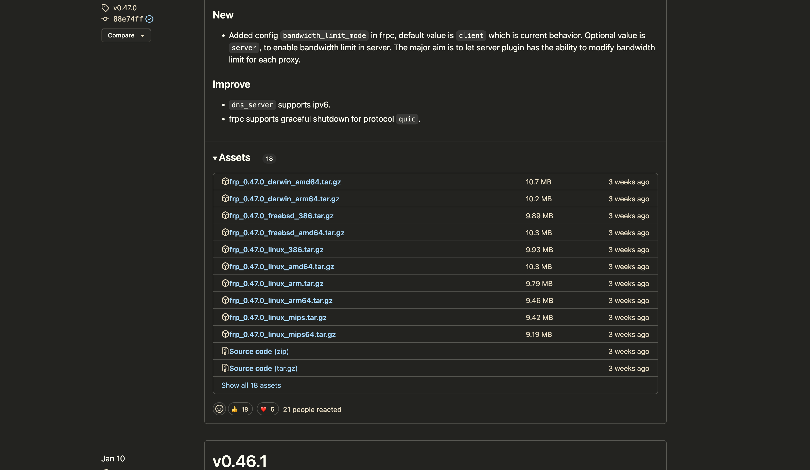

## 工具目的
> 将本地运行的http服务，穿透到外网，即通过外网IP即可访问到我们本地的web服务

如，我的云服务器IP为：`150.158.153.134`
同时，我本地运行了一个简单的Java Web服务
我们同时在服务器端和本地客户的启用frp程序，最终，我们可以通过`150.158.153.134`的IP来访问本地Web服务(先忽略端口)

## 使用frp前提

1. 拥有云服务器
2. 最好是有一个域名，并且解析到云服务器IP

## frp介绍
> frp 是一个专注于内网穿透的高性能的反向代理应用，支持 TCP、UDP、HTTP、HTTPS 等多种协议。可以将内网服务以安全、便捷的方式通过具有公网 IP 节点的中转暴露到公网。


[Github frp](https://github.com/fatedier/frp)

[frp下载](https://github.com/fatedier/frp/releases)

[frp使用文档](https://gofrp.org/docs/)

## 下载并配置frp

根据我们不同客户端，下载对应的frp即可



如，我的云服务器是centos8系统，本地是Mac系统，因此，我需要同时下载`rp_0.47.0_linux_arm.tar.gz
`和`frp_0.47.0_linux_386.tar.gz`

分别解压后

### 云服务配置

修改云服务器中`frps.ini`配置文件
```ini
[common]
bind_port = 7000
vhost_http_port = 9000
token = 5555
```

并执行启用命令：`./frps -c frps.ini`，打印以下内容则表示启动成功

```log
2023/03/06 13:42:32 [I] [root.go:206] frps uses config file: ./frps.ini                                          
2023/03/06 13:42:33 [I] [service.go:200] frps tcp listen on 0.0.0.0:7000                                         
2023/03/06 13:42:33 [I] [service.go:261] http service listen on 0.0.0.0:9000                                     
2023/03/06 13:42:33 [I] [root.go:215] frps started successfully
```

### 本地配置

修改本地`frpc.ini`
```ini
[common]
server_addr = 150.158.153.134
server_port = 7000
token = 5555

[web]
type = http
local_port = 9000
custom_domains = wudiguang.top
```

并执行启用命令：`./frpc -c frpc.ini`，打印以下内容则表示启动成功
```log
2023/03/06 13:44:16 [I] [service.go:299] [49d8ae493b387661] login to server success, get run id [49d8ae493b387661], server udp port [0]
2023/03/06 13:44:16 [I] [proxy_manager.go:142] [49d8ae493b387661] proxy added: [web]
2023/03/06 13:44:16 [I] [control.go:172] [49d8ae493b387661] [web] start proxy success
```

此时，我们就可以用过客户端配置中的`custom_domains`来进行访问本地暴露的端口号为`9000`的http服务

访问地址为：`wudiguang.top:9000`

## 配置nginx代理

```conf
server {
		listen 80;#监听的端口号
		server_name frp.wudiguang.top; #监听地址
		location / { 
		    root html; #代表html路径
		    proxy_pass http://wudiguang.top:9000;
	            index index.html index.htm;
		}
	    error_page   500 502 503 504  /50x.html;
	    location = /50x.html {
	        root   html;
	    }
    }
```

于是，我们可以通过`http://frp.wudiguang.top`来访问本地启用的http服务(服务端口为`9000`)
