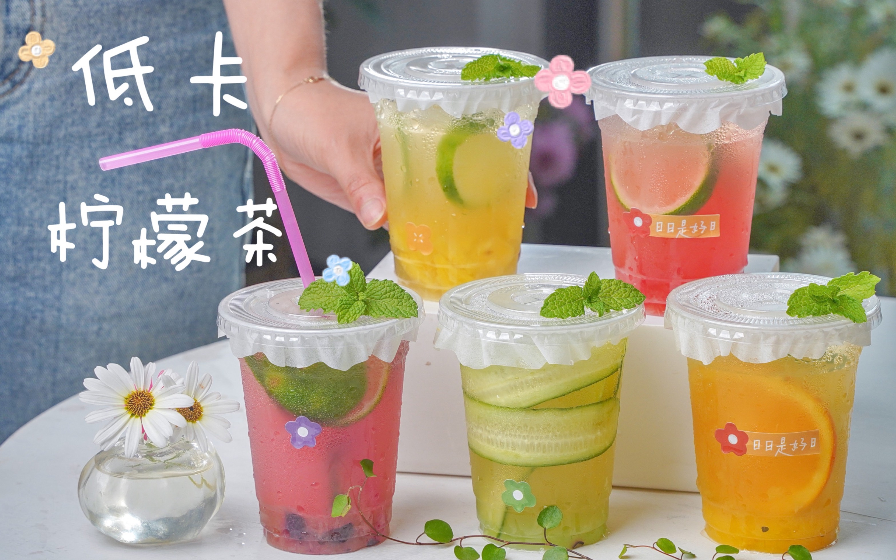

[封面图]

## 采购

1. 6.5L冷水桶（带水龙头）（6.5L*2冷水壶  10.9+10.98）
2. 奶茶杯：500ml，胖胖杯，发财和暴富两款    （21.88元/50个）
3. 打包袋：98口径 500ml 100个   （7元/100个）
4. 桌面收纳盒4格  （7.98元/大号）
5. 防水防油桌布 80*120cm  (7.94元/个）
6. 透明防水防油水晶板80*80cm (6.42元/个）
7. 茶叶过滤袋  中号奶茶袋带钢圈  （5.85元/个）
8. 雪克杯 升级加厚款+捣汁棒  （9.87元/套）
9. 糖压瓶 10cc1600ml  （11.16元/套）
10. 96格大冰格 10层+4层  （18.39元+7.34元）
11. 冰块铲子  （1元/个）
12. 塑料冷水壶耐高温食品级pp5  5000ml有盖  （10.2元/个）
13. 柠檬果蜜 2.5kg  (23.2元/桶）
14. 保温箱9L  （30.82元/个）
15. 鸭屎香500g茶叶 （21.85元）
16. 茉莉绿茶500g茶叶   （13.69元）
17. 遮阳伞 2.2m（38元）
18. 注水底座可装20L水(20.79元）

总额度：

## 成本、收益计算

|  饮料类型   | 售价(元)  | 成本(元)  |
|  ----  | ----  | ----  |
| 冰鲜柠檬水  | 4 | 1.5 |

## 收入记录

|  日期   | 已售  | 营业额(元)  |
|  ----  | ----  | ----  |
| 2023/05/28  | 青桔柠檬茶x1   冰鲜柠檬水x7 | 36 |