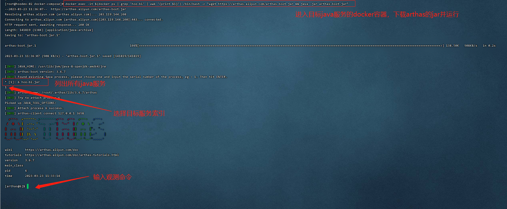
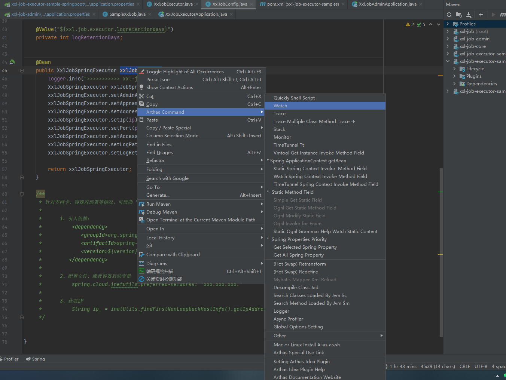

[封面图]


## 简介

Arthas 是一款线上监控诊断产品，通过全局视角实时查看应用 load、内存、gc、线程的状态信息，并能在不修改应用代码的情况下，对业务问题进行诊断，包括查看方法调用的出入参、异常，监测方法执行耗时，类加载信息等，大大提升线上问题排查效率。

Arthas 旨在解决线上debug问题。开发人员可以在线解决生产问题。无需 JVM 重启，无需代码更改。 Arthas 作为观察者永远不会暂停正在运行的线程。

## Arthas能为你做什么？

1. 这个类从哪个 jar 包加载的？为什么会报各种类相关的 Exception？
2. 我改的代码为什么没有执行到？难道是我没 commit？分支搞错了？
3. 遇到问题无法在线上 debug，难道只能通过加日志再重新发布吗？
4. 线上遇到某个用户的数据处理有问题，但线上同样无法 debug，线下无法重现！
5. 是否有一个全局视角来查看系统的运行状况？
6. 有什么办法可以监控到 JVM 的实时运行状态？
7. 怎么快速定位应用的热点，生成火焰图？
8. 怎样直接从 JVM 内查找某个类的实例？

## 是否能在生产环境使用Arthas

## 运行Arthas并绑定目标java服务

在运行java服务的机器上，下载并运行arthas：`wget https://arthas.aliyun.com/arthas-boot.jar && java -jar arthas-boot.jar`



**开启监听**

```shell
watch com.wdg.Executor onTime '{params,returnObj,throwExp}'  -n 50  -x 3 
```

`上面命令功能：监听`com.wdg.Executor`类中的`onTime`方法，循环次数为50次，解析参数深度为3层`

## debug运行在docker中的java服务

第一步：`docker ps -a` 查询出目标java服务docker容器的Name

第二步：`docker exec -it $(docker ps | grep 'container name' | awk '{print $1}') /bin/bash -c "wget https://arthas.aliyun.com/arthas-boot.jar && java -jar arthas-boot.jar"`

第三步：选择对应得java服务索引

其中第二步中`container name`为docker种java服务的容器名

## IDEA搭配Arthas插件使用

[IDEA插件](https://plugins.jetbrains.com/plugin/13581-arthas-idea)



## Arthas命令大全

[在线访问](https://arthas.aliyun.com/doc/watch.html)


