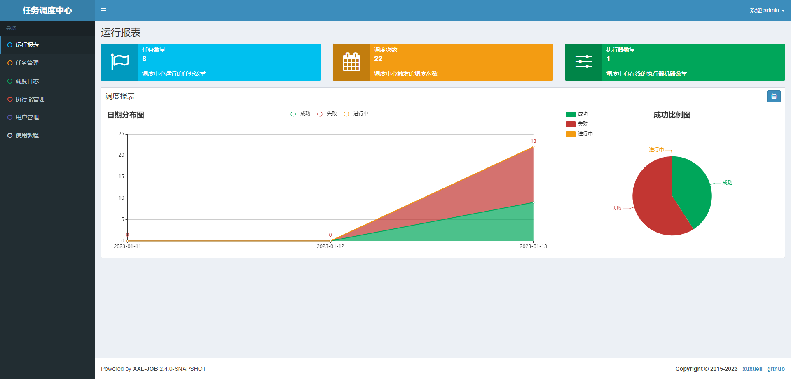
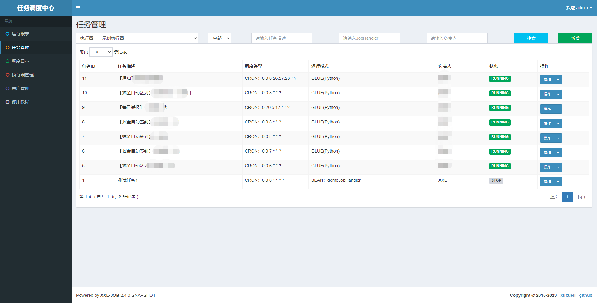
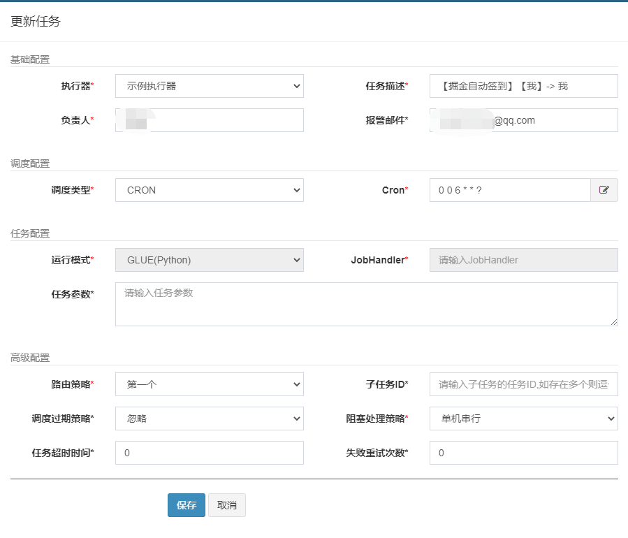

[封面图]


## 摘要

&nbsp;&nbsp;由于我是个掘金用户，而掘金平台可以通过每天签到来获取"矿石"，这里获取的矿石可以用来换取一系列礼物，诸如马克杯、咖啡机、烤面包机、卫衣等等非常实用的物品。原本我可以老老实实的每天签到、每天一次免费抽奖，来积累"矿石"，但是...我偏不。

于是乎开始寻找偏方，能让我不用每天自己去点签到。

## 自动签到脚本挖掘

&nbsp;&nbsp;&nbsp;&nbsp;不太记得是2022年8月份的哪一天，突发奇想地去搜索了一下掘金自动签到脚本，于是找到了比较完整的nodejs的签到脚本。这里就不贴出来了，有需要的可以找我~

&nbsp;&nbsp;&nbsp;&nbsp;于是我在本地一次又一次尝试运行脚本，实现自动签到。我尝试了windows设置定时任务去执行这个脚本、也想要尝试放到服务器上去，使用shell来实现定时执行。这两种方法最终都放弃了，因为windows会经常关机，如周末或者放假，而这几天可能脚本就无法定时被执行了；而放弃另一种原因倒是简单粗暴很多，原因是我不会太shell。

## 发现腾讯云函数
  
&nbsp;&nbsp;&nbsp;&nbsp;一次偶然的机会，当时对云原生内容做探索，从k8s到serverless ，然后发现腾讯云函数。这时候突然就将自动签到脚本和腾讯云函数关联起来了，截止到2023年1月份，已经使用了近5个月时间，一直是免费的~。就在前几天还是免费的... 短短几天，花了我差不多5元余额巨款。下面我把这几天腾讯云函数支出明细贴出来

  

  这个支出记录看的我心寒，使用云函数也就几个月了，这段时间分文不取，而从2023年1月初开始，对我疯狂吸血。还好我里面余额并不多~，今天也是腾讯消息提醒我以及欠费了...我真惊了。
  不过，我还是很感激腾讯云函数，让我接触了一下serverles产品

## 从腾讯云函数到xxl-job

&nbsp;&nbsp;&nbsp;&nbsp;首先，我们需要xxl-job是什么，xxl-job是一个轻量级分布式任务调度平台，其凭借学习简单、轻量级、易扩展等众多优点，让国内众多公司去使用它。

&nbsp;&nbsp;&nbsp;&nbsp;其实，我们想要做自动签到的功能，只是需要两个东西，其一是签到脚本，其二就是自动触发签到脚本的机制。我之前尝试的无论是windows本地触发签到，还是使用腾讯云函数签到，其实核心都是提供一个调度签到脚本的平台。

&nbsp;&nbsp;&nbsp;&nbsp;于是与，今天上班摸鱼的时候，突然就想到了xxl-job，说偶然，也并不都是偶尔，因为很早以前接触过xxl-job，另外，我们目前系统中也在使用xxl-job，一切水到渠成

## xxl-job平台搭建

### Github拉取xxl-job源码

```shell
git clone https://github.com/xuxueli/xxl-job.git
```

### 数据库中执行db/xxl-job.sql脚本

### 修改项目中的配置

* xxl-job-admin：修改数据库连接地址和账号密码(制定web服务运行端口)
* xxl-job-executor-sample：配置中admin端口要和上面一致
* 配置邮件提醒

### 打包运行
* java -jar xxl-job-admin/target/xxx.jar
* java -jar xxl-job-executorr-sample/target/xxx.jar

### 如何使用使用

浏览器地址栏输入：`http://IP:PORT/xxl-job-admin`

上面IP是部署执行admin jar包的IP地址，PORT是admin jar包的端口

如果看到下面页面，则表示xxl-job部署成功




## 创建自动签到脚本任务




&nbsp;&nbsp;&nbsp;&nbsp;这里的运行模式我选择是的Python脚本方式，弃用了原来的nodejs，创建好任务后，我们使用GLUE IDEA打开脚本编辑器，这里就可以放入我们的签到脚本啦~
上面任务配置中我设置的是每天早上6点触发。

另外，我引入了pushplus，每次签到成功后，我的微信会受到一条消息推送，如下图


### 脚本编写

```js
#!/usr/bin/python
# -*- coding: UTF-8 -*-
import requests
from datetime import datetime
import time
import json
import sys
reload(sys)
sys.setdefaultencoding('utf8')

```

### 填写对应参数的值

```js
data = {
    'aid': '填入',
    'uuid': '填入',
    '_signature': '填入',
    'cookie': '填入'
}

header = {
    "cookie": data.get('cookie')
}

def sign_in():
    """
    请求签到接口
    :return: 
    """
    url = 'https://api.juejin.cn/growth_api/v1/check_in'
    r = requests.post(url, data, headers=header)
    print(r.text)
    return json.loads(r.text)['err_msg']


def draw():
    """
    签到后抽奖
    :return: 
    """
    urlD = 'https://api.juejin.cn/growth_api/v1/lottery/draw'
    dataD = {
        'aid': data.get('aid'),
        'uuid': data.get('uuid'),
    }
    r = requests.post(urlD, dataD, headers=header)
    print(r.text)
    return json.loads(r.text)['err_msg']


def start():
    """
    启动任务
    :return: 
    """
    print(datetime.now().strftime("%Y-%m-%d %H:%M:%S"))
    sign_msg = sign_in()
    time.sleep(10)
    draw_msg = draw()
    return "签到返回：" + sign_msg + '\n' + "抽奖返回：" + draw_msg

def send(str):
    body = {
		"token": 'pushplus token',
		"title": '我是消息推送的标题',
		"content": str
    }
    r = requests.post('http://www.pushplus.plus/send', data=body)
    print(json.loads(r.text))


if __name__ == "__main__":
    str = start()
    send(str)
exit(0)
```
获取上面脚本中需要的参数

访问pushplus使用微信登录，获取一个推送token，用来给微信推送消息提醒

发给女朋友的每日播报

```js
#!/usr/bin/python
# -*- coding: UTF-8 -*-
import requests
import json
from lxml import etree  
import time
import datetime
import sys
reload(sys)
sys.setdefaultencoding('utf8')
```

### 今日天气

```js
def weather():
    r = requests.get('https://autodev.openspeech.cn/csp/api/v2.1/weather?openId=aiuicus&clientType=android&sign=android&city=%E5%8D%97%E6%98%8C&latitude=115.96191&longitude=28.68194&needMoreData=true&pageNo=1&pageSize=7%20')
    weatherinfo = json.loads(r.text)['data']['list'][0]
    result = "<p>南昌天气 <span style=\"font-size:30px;color:#674ea7;\">"+ weatherinfo['weather'] +"</span></p><p>最低气温 <span style=\"font-size:30px;color:#674ea7;\">"+ str(weatherinfo['low']) +"</span></p><p>最高气温 <span style=\"font-size:30px;color:#ffd966;\">"+ str(weatherinfo['high']) +"</span></p><p>天气信息发布时间 <span style=\"font-size:25px;color:#e69138;\">"+ weatherinfo['lastUpdateTime'] +"</span></p>"
    return result

```

### 每日一句

```js
def word():
    get_request = requests.get(url='https://v.api.aa1.cn/api/yiyan/index.php')  # 向api接口发送请求
    html = etree.HTML(get_request.text)  # html：爬取得到的网页html内容
    text = html.xpath('/html/body/p/text()')[0]  # xpath路径下提取text文本,取得列表中的第0项，就是一个字符串
    print(text)  # 打印获得的每日一句
    text = "<p>每日一句 <span style=\"font-size:30px;color:#674ea7;\">"+ text +"</span></p>"
    return text

```

### 计算两个日期间天数

```js
def days(d1, d2):
    return (d1 - d2).days

def kaoshi():
    kaoshi_day = days(datetime.datetime(2023, 3, 11), datetime.datetime.now())
    text = "<p>教资考试剩余天数 <span style=\"font-size:30px;color:#674ea7;\">"+ str(kaoshi_day) +"</span></p>"
    return text

def love():
    love_day = days(datetime.datetime.now(), datetime.datetime(2022, 1, 7))
    text = "<p>恋爱天数 <span style=\"font-size:30px;color:#674ea7;\">"+ str(love_day) +"</span></p>"
    return text

def lover_next_birth():
    next_birth_day = days(datetime.datetime(2024, 1, 17), datetime.datetime.now())
    text = "<p>距离下一次生日天数 <span style=\"font-size:30px;color:#674ea7;\">"+ str(next_birth_day) +"</span></p>"
    return text

def week():
    week_list = ["星期一","星期二","星期三","星期四","星期五","星期六","星期日"]
    today = datetime.datetime.today()
    text = "<p> <span style=\"font-size:30px;color:#674ea7;\">"+ week_list[today.weekday()] +"</span></p>"
    return text

def now():
    now_time = time.strftime('%Y-%m-%d %H:%M:%S', time.localtime())
    text = "<p>当前时间 <span style=\"font-size:30px;color:#674ea7;\">"+ now_time +"</span></p>"
    return text

def now_day():
    now_time = time.strftime('%Y-%m-%d', time.localtime())
    return now_time

def send(str):
    body1 = {
		"token": 'pushplus token',
		"title": '每日播报(' + now_day() + ")",
		"content": str
    }
    r1 = requests.post('http://www.pushplus.plus/send', data=body1)
    print(json.loads(r1.text))
    
    body2 = {
		"token": 'pushplus token',
		"title": '每日播报(' + now_day() + ")",
		"content": str
    }
    r2 = requests.post('http://www.pushplus.plus/send', data=body2)
    print(json.loads(r2.text))

if __name__ == "__main__" :
        send(weather() +  word() + love() + kaoshi() + lover_next_birth() + now())


exit(0)
```