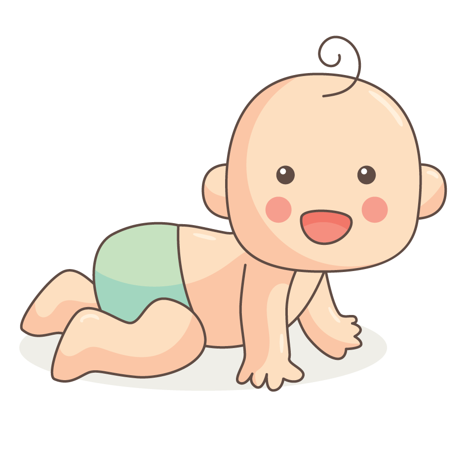

[封面图]

兮兮，你好呀，我是爸爸~

兮兮这个名字是爸爸妈妈一起给你取的，"兮"字和珍惜的"惜"字读音相同，寓意着你的到来，爸爸妈妈会很珍惜你，爱惜你；喜欢宝宝喜欢这个名字

爸爸现在正在公司上班，但是爸爸满脑子都是关于即将出生的你，我的宝宝。

宝宝你在妈妈肚子里面已经23周零4天啦！爸爸妈妈昨天去医院给你做了四维彩超检查，结果显示兮兮你是健健康康的！我和妈妈真的真的好开心！

昨天是2023年8月1日，爸爸妈妈一大早就去医院排队做四维彩超，四维彩超就是给兮兮拍一些照片，看看兮兮的手脚、五官是不是有异常。有一些妈妈做四维彩超一次性就能通过，但是兮兮的妈妈做了三次！因为总是拍不到兮兮的小脸蛋，于是为了调整兮兮的姿势，妈妈只能通过运动，来尝试调整兮兮的姿势，这样四维彩超才能看到兮兮的小脸蛋，这样爸爸妈妈才能看到我们的兮兮宝宝的小脸蛋！妈妈在上午做了两次检查，没有成功，爸爸妈妈吃饭完后，妈妈一个人继续去医院给宝宝拍照片了。（因为爸爸要赚钱给兮兮奶粉呢）

上面妈妈做了三次检查才成功可不是因为兮兮不乖哦！医生说是因为兮兮太活跃啦~，我觉得不是，我觉得是因为兮兮知道快要见到爸爸妈妈了，非常开心呢，所有一直在妈妈肚子里翻来覆去的！

兮兮，妈妈在一次产检中被告知体内有一些激素含量不在正常范围内，于是医生说要让妈妈去打针，要连续一个月的每天打针，并且是爸爸给妈妈打针噢，打针的位置在肚子上，在肚脐眼周围呢！兮兮想一想，是不是觉得很可怕呀，但是妈妈很勇敢的，因为爸爸也是第一次给人打针，所以一个月下来，妈妈肚子上总是青一块紫一块的，有时候还会流很多血呢。兮兮，你看妈妈多么勇敢呀，希望兮兮你以后也能像妈妈一样勇敢~

妈妈是一个很容易为一些未知的事情担心害怕的人，自从我们得知宝宝你的存在时开始，妈妈就一直担心这、担心那的。

妈妈生病了，都是不敢看病吃药的噢，她会担心吃药会影响兮兮的健康成长。

妈妈摔跤了，她又会担心可能会伤到兮兮，甚至让兮兮离开我们，虽然妈妈的膝盖已经流了很多血，甚至长时间留下伤疤。

妈妈是一个既坚强，又是一个十分脆弱的人。所有关于兮兮的事情，妈妈都会很担心害怕。

兮兮，你应该不知道吧，自从有了兮兮后，妈妈基本上每个月都要去医院做检查，每次做检查，妈妈都会很害怕，害怕宝宝在妈妈肚子里不乖、害怕宝宝的各项指标不正常等等等等。

兮兮，这段时间你在妈妈肚子里可活跃了！

兮兮，爸爸希望兮兮以后一定要对妈妈很好很好，不然爸爸会很生气的！

兮兮呀，爸爸妈妈现在还不知道兮兮的男宝宝还是女宝宝呢，爸爸妈妈现在只是希望兮兮能健健康康的，还有3个多月，兮兮就能和爸爸妈妈见面啦！

兮兮，爸爸妈妈已经开始准备买一些给兮兮出生后要用的东西啦，比方说兮兮睡觉的床、带兮兮出去玩的车车、还有兮兮出生后要吃的奶粉...，有好多东西要准备的，爸爸妈妈要忙活一段时间才能准备好呢

兮兮，爸爸是一个十分坚强的人！每次妈妈为兮兮的事情担心的时候，爸爸都是一副若无其事的样子。偷偷告诉兮兮，爸爸其实也和妈妈一样，也是非常担心兮兮的健康呢，只是不能表现出来，这样妈妈会更加担心的！

兮兮，妈妈虽然比你大28岁，但是妈妈真的喜欢吃一些零食呢，兮兮现在可能还不知道什么是零食吧！每次妈妈说要吃零食，我都会担心妈妈吃零食会影响兮兮的生长发育。我希望兮兮以后少吃些零食，多吃一些水果和米饭，我希望兮兮身体能一直健健康康的~

兮兮呀，妈妈虽然比你大28岁，但是妈妈也有有一些小脾气噢，如果你以后把家里弄得一团糟，爸爸妈妈可能会有点生气的。但是呢，兮兮，这可不是兮兮做错了什么事噢，只是爸爸妈妈难以站在小兮兮的角度去理解兮兮的各种行为，因为爸爸妈妈比兮兮大了太多了，已经忘记了自己小时候的一些任性啦

兮兮呀，偷偷告诉你，爸爸在给兮兮写一封信的时候，是非常开心的，眼里一直有一些开心的泪水。

兮兮，爸爸是一个不太乐于去各种景点或者远距离游玩的人，但是呢，等兮兮出生后并且长大了一些，爸爸一定会经常带兮兮去玩，去各种有趣的地方玩，带兮兮一起去看各种风景和很多很多不一样的人。

兮兮呀，爸爸妈妈真的很期望兮兮的到来呢，但是啊，关于如何照顾好小兮兮、如何教育好小兮兮，爸爸妈妈还不懂呢，所以，爸爸妈妈这段时间要去好好恶补一下这方面的知识噢~，爸爸妈妈要去学习如何让兮兮过的开心、如何让兮兮得到更好的家庭教育、已经如何让兮兮健健康康的。

爸爸妈妈希望兮兮能感受到我们对你的爱，这些爱，能让兮兮过的开心，过的快乐~

