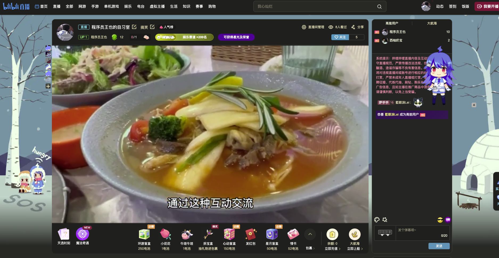
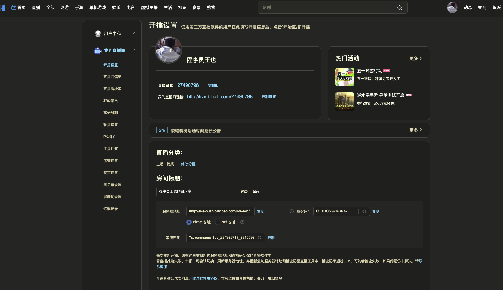

[封面图]



使用 kplayer 搭建无人值守直播，以 rtmp 方式推流到 bilibili 网站

本文将介绍如何使用 kplayer 搭建无人值守直播，并以 rtmp 方式推流到 bilibili 网站。本文由作者王也编写，适用于需要进行远程直播的用户。

## 介绍

kplayer 是一款基于 Golang 的媒体服务器，支持 RTMP 协议。在本文中，我们将使用 kplayer 搭建无人值守直播，将视频流推流到 bilibili 网站。

## 步骤

1. B站获取到rtmp推流地址
2. 安装配置Kplayer


### B站获取到rtmp推流地址

进入B站首页 -> 点击左上角“直播” -> 点击右侧“开播设置” -> 填入直播间信息（标题、分类等）

此时，页面中即可看到`服务器地址`和`串流密钥`，复制`串流地址`字符串，第二步要用。



### 安装配置Kplayer

推荐版本：0.5.8，支持制定视频目录播放

**下载kplayer**

```
wget http://download.bytelang.cn/kplayer-v0.5.8-linux_amd64.tar.gz
tar zxvf kplayer-v0.5.8-linux_amd64.tar.gz
```

**配置kplayer**

进入kplayer目录，复制配置文件

```
cd kplayer
cp config.json.example config.yaml
```

下面是我本地的配置内容，将第一步中获取到的B站推流地址替换`${rtmp}`，再将本地视频目录替换下面的`/usr/local/nginx/html/videos/`即可

```json
{
    "version": "2.0.0",
    "resource": {
        "lists": [
            "/usr/local/nginx/html/videos/"
        ],
        "extensions" : ["mp4", "flv", "mov"]
    },
    "output": {
        "lists": [
            {
                "path": "rtmp://live-push.bilivideo.com/live-bvc/${rtmp};"
            }
        ]
    }
}
```

**运行kplayer**

```
./kplayer play start
```


