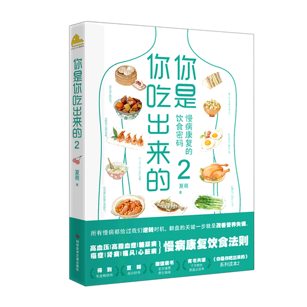

[封面图]

## 慢病时代--饮食革命带来防治新契机

### 我们活在快餐当道的世界，身体却困在了石器时代。

国际上有个标准，寿命等于成熟期的5～7倍者为长寿。按照这个说法，长寿之人应该能活到100～175岁。可是到目前为止，全世界还没有任何一个国家的人均寿命能够达到或接近这个标准。

2015年5月，世界卫生组织发布了《世界卫生统计报告》。报告指出，全世界人口的寿命都较以往有所增加。

中国在此报告中的人均寿命为：女性77岁，男性74岁。

日本，人均寿命在全世界排名第一，国明平均寿命为84岁。

疾病的本质：细胞损伤速度超过修复速度。

人体是由细胞组成的，一般情况下，当细胞死亡数达到总量的20%时，人就会死亡。

细胞的生命周期基本固定。比如血管的内皮细胞1天就会死亡；胃黏膜细胞3～5天更替一次；肺表面的细胞寿命是2～3周；皮肤最外面的角质层细胞28天左右就要换新；肝细胞能存活150天左右；心脏细胞更新速度要慢很多，大约需要20年；而大脑细胞一生一世不再跟更新。

影响细胞修复速度：不健康的心理或者不合理的饮食、运动、睡眠等生活方式。

1. 冠心病
2. 高血压
3. 糖尿病
4. 肿瘤
5. 抑郁症
6. 气管炎
7. 哮喘
8. 慢行肾病

上面这类疾病都是由不恰当的生活方式引起的，医学工作者将这些疾病统一归类为慢行非传染性疾病。

治疗慢病的医疗花费大，死亡率、残疾率高，比车祸、战争造成的死亡人数还要多得多。据统计，中国每5个人中就有1个确诊为慢病患者，慢病导致的死亡人数占中国总死亡人数的85%。

慢病如何阻止？

血压高了用降压药，血糖高了用降血糖，肿瘤长出来了切除，哮喘用抗哮喘药，等等。结果呢？钱花了，罪受了，人还是走了。

得慢病的人越来越多，无法预防；慢病患者的病越来越严重，无法治愈，究竟是为什么？治疗方向错了--这种对抗疗法以前是用来针对外来因素给人体造成的疾病。如外伤，病毒感染导致的疾病，常采用止血、抗炎、抢救和预防接种等方式，但并不适用于慢病。慢病诗行为方式错误造成的，矫正错误行为才是根本。

身体向我们发出的求救信号，如易疲劳、疼痛、过敏、咳嗽、便秘、腹泻、血压增高、血糖上升......这时候应该纠正错误的生活方式，把造成问题的原因解决掉，规律作息，增加运动，戒烟戒酒，等等。但大多数人的选择却是吃药，把症状压下去。

追根究底，慢病源于各种不平衡，比如缺乏睡眠、长期吸烟、大量饮酒、不运动等等。这种不平衡加速度越快，积累种类越多，得慢病的可能性就越大，而且患病年龄大大提前。

在细胞损伤和修复的博弈过程中，能给细胞修复提供原料的只有饮食。

人体细胞的自我修复能力取决于两个主要隐私：与生俱来的细胞生命周期、后天的营养状况。

先天因素决定了修复速度，后天因素决定了修复质量。

`疾病的发展，就是细胞损伤和细胞修复之间的博弈。`

修复细胞损伤的唯一原料：食物中的营养素

吃什么？如何吃？

不能偏食，注意搭配。每一种食物都含有自己独特的营养素。

**七大类营养素**

1. 碳水化合物（又称为糖类，包括葡萄糖、果糖、麦芽糖、淀粉等）
2. 蛋白质（分为必需氨基酸和非必需氨基酸）
3. 酯类（氛围脂肪和类脂，脂肪又叫甘油三酯，分为必需脂肪酸和非必需脂肪酸；类脂包括磷脂、胆固醇、胆固醇脂、糖脂）
4. 维生素（分为脂溶性维生素和水溶性维生素）
5. 矿物质（分为常量元素和微量元素）
6. 膳食纤维（分为可溶性膳食纤维和不可溶性膳食纤维）
7. 水

平衡膳食是指选择的食物能满足成人和儿童对能量及各种营养素的需求。

需求：为细胞新陈代谢提供能量，为新生细胞更新提供结构原料，为人体新陈代谢提供媒介，维持肠道细菌均衡，等等。

搞清楚消耗量，以此作为每一天摄入食物的标准，并坚持完成自己应该达到的营养平衡，这个人就是健康的。

一个人如果躺着不动，室温保持在20～25摄氏度，测出来的能量消耗成为基础代谢。一般来说，男性为1400千卡/天左右，女性在1300千卡/天左右。

人体能量消耗：
1. 运动方面：经常遇到弄给你的人和体力劳动者消耗的碳水化合物更多一些。
2. 心理方面：大脑消耗的营养素与肌肉消耗的营养素不一样，用脑越多越需要多补充蛋白质、维生素、矿物质，还有脂类重的胆固醇、磷脂和DHA（脑黄金，不饱和脂肪酸）和EPA（血管清道夫，鱼油的主要成分）
3. 熬夜：消耗的营养素会更多，如维生素A，维生素B族、磷脂和蛋白质等
4. 吸烟：需要更多的抗氧化剂来对抗尼古丁等毒素对人体的伤害
5. 喝酒：伤肝，需要更多的营养素来修复肝脏细胞，如维生素B族和蛋白质

营养要做到“量入为出”

提倡低盐，要求每天吃盐不要超过6克。但是，在南方潮湿闷热的地区，尤其是夏天，就不能要求一定要低于6克了。

因人而异，因地而异。

人们很容易在大汗后出现低钠血症。

**七大营养素为细胞做了什么？**

1. 为细胞新陈代谢提供能量
2. 为新生细胞更细提供结构原料：人体结构是可以用内眼看得见的，比如这个人的个子高矮、胖瘦、肌肉是否发达、头发是否浓密、皮肤是否有弹性，等等。
3. 为新陈代谢提供媒介：人的新陈代谢是在酶的催化下完成的。酶的主体是蛋白质，辅助部分叫做辅酶，辅酶的主要成分是维生素和矿物质。
4. 养肠道细菌：肠道里尤其是结肠中存在大量细菌，体积很小，数量很多。人体由40亿～60亿个细胞组成，而我们身上的细菌数量是人体细胞数量的10倍，并且主要在肠道里，肠道里的细菌靠食物中的膳食纤维养活。

总结起来就是，食物进入人体中有四个主要去向：
1. 给细胞提供能量--主要靠碳水化合物类，即粮食、水果等
2. 成为细胞结构--主要靠蛋白质类和脂类，主要存在于肉、蛋、奶、鱼中
3. 调节细胞代谢--蛋白质类和胆固醇类，还有维生素、矿物质
4. 养肠道菌群--食物中的膳食纤维

这就是七大营养素修复细胞损伤的方式，那么要达到平衡，究竟应该吃什么，怎么吃呢？

### 预防慢病吃什么：35%动物类食物+65植物类食物

基因决定了心脏怎样跳、肝脏做什么功、肾脏干什么活，决定了人应该睡多长时间、应该几点起床几点睡觉、应该喝多少水、应该吃多少食物以及运动的时间和程度。

当人们顺应基因确定好的细胞需求去生活，就能长寿；如果一味的任性，想吃什么就吃什么，想几点睡就几点睡，生活方式与基因编码不对等，疾病就会找上门来。

回顾人类发展史，从中找到一些规律

**旧石器时代：首次荤素搭配，脑容量激增**

从大约距今250万年开始，非洲东部地壳发生变化，完全靠采集植物为生的古猿只好下地寻找食物，就此开始了荤素搭配的饮食结构。只为充饥的行为，带来的却是食物链的增宽，大脑变得聪明，踢个更佳健壮，开始了向人类方向的进化。

恩格斯：“从只吃植物过渡到同时也吃肉，是古猿转变成人的重要一步。”，在生存环境和饮食方式改变的过程中，我们的老祖宗逐渐开始直立行走。

人类在动物里不是最高大的，不是最有力气的，要围攻一个大型动物很不容易，大家要团结一心，开动脑筋想办法。也是从这一阶段，人类开始有意识地制造一些石器，开启了旧石器时代。

**农牧时代：食谱变窄，进化停滞**

随着工具的使用和社会的发展，人们开始在原野上选择一个适当的地方搭建栅栏，把一是吃不完的野马、野马或鹿驱赶进去，让它们暂时生活在那里，形成了畜牧业的雏形。

公元前

