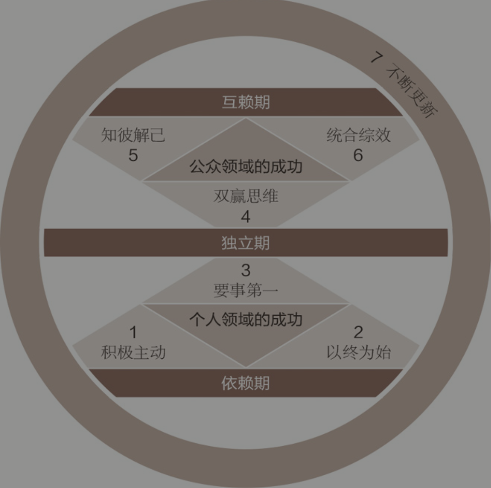

[封面图]

## 思维方式与原则

### 由内而外全面造就自己

没有正确的生活，就没有真正卓越的人生

每个人的思维方式都是那么根深蒂固，仅仅研究世界是不够的，还要研究我们看世界时所戴的"透镜"，因为这透镜(即思维方式)往往左右着我们对世界的看法

要改变现状，首先要改变自己，要改变自己，先要改变我们对问题的看法。

`品德与个人魅力熟重`

* 品德：成功之本，如诚信、谦虚、忠诚、节欲、勇气、公正、耐心、勤勉、朴素和一些称得上是金科玉律的品德。鼓吹盲目积极乐观
* 个人魅力：认为成功与否更多取决于性格、社会形象、行为态度、人际关系以及长袖善舞的圆熟技巧。注重人际关系和公关技巧

`光有技巧还不够`

耕种是一个自然体系，必须付出代价，一步一步完成。一分耕耘，一分收获，没有捷径可循。

归根到底，我们的本质要比言行更具说服力。

人性可善可恶，冥冥中影响着我们的一生，而且总是如实反映出真正的自我，那是伪装不来的。

`思维的力量`

`思维转换的力量`
不论思维转换的结果是否积极，过程是否渐进，都会让我们的世界观发生改变，而且改变的力量惊人。不论思维方式是否正确，都会决定我们的行为和态度，并最终影响到我们的人际关系。

"一颗邪恶的大树，砍它枝叶千斧，不如砍它根基一斧。"行为和态度就是枝叶，思维方式就是根基，抓住根本才能让生活出现实质性的进展。

`身体力行`
思维方式和性格息息相关。从人类这个角度而言，你的观念会从为人中体现出来。我们对待事物的方式和性格紧密相关。如果不把性格和视角上的改变结合起来，是难有成效的。

`以原则为中心的思维方式`
品德成功论根植于一个基本信念之上，那就是人类效能都需要原则作指引，这是放之四海而皆准的真理，和物理学中的万有引力法则一样，都是毋庸置疑、不容忽视的自然法则。

任何人只要对人类历史的盛衰兴替有深切了解，都会承认这些原则是颠扑不破、历久弥新的。国家社会的存亡与兴衰，往往就取决于是否能遵奉这些原则。

* 公平原则：平等与正义的理念便由此而来
* 诚信与正直原则：是人类相互信任的基础，有了信任，才有可能互助合作，实现个人与群体的持续成长
* 服务原则：指人类可以不断成长、进步，释放潜能和施展才华。

实践是个别的、具体的，而原则是深刻的、基本的和普遍的。原则适用于任何人、婚姻、家庭以及公私机构。如果我们把原则内化为习惯，就能够用不同的实践方法应对任何局面

原则不是价值观。一群盗匪可以有相同的价值观，但却违背了良善的原则。如果说原则是地域，那么价值观就是地图。唯有尊重正确原则，才能认清真相。

一个人的思维方式越符合这些原则或者自然法则，就越能正确而高效地生活。

`成长和改变的原则`
个人魅力论之所以让大家趋之若鹜，就是因为它号称能够让人们跨过事物成长的自然过程，迅速而轻松地实现个人效能和人际关系成果丰硕的圆满人生。

2023-03-02 15:44

## 个人领域的成功：从依赖到独立

## 公众领域的成功：从过年独立到依赖

## 自我提升与完善